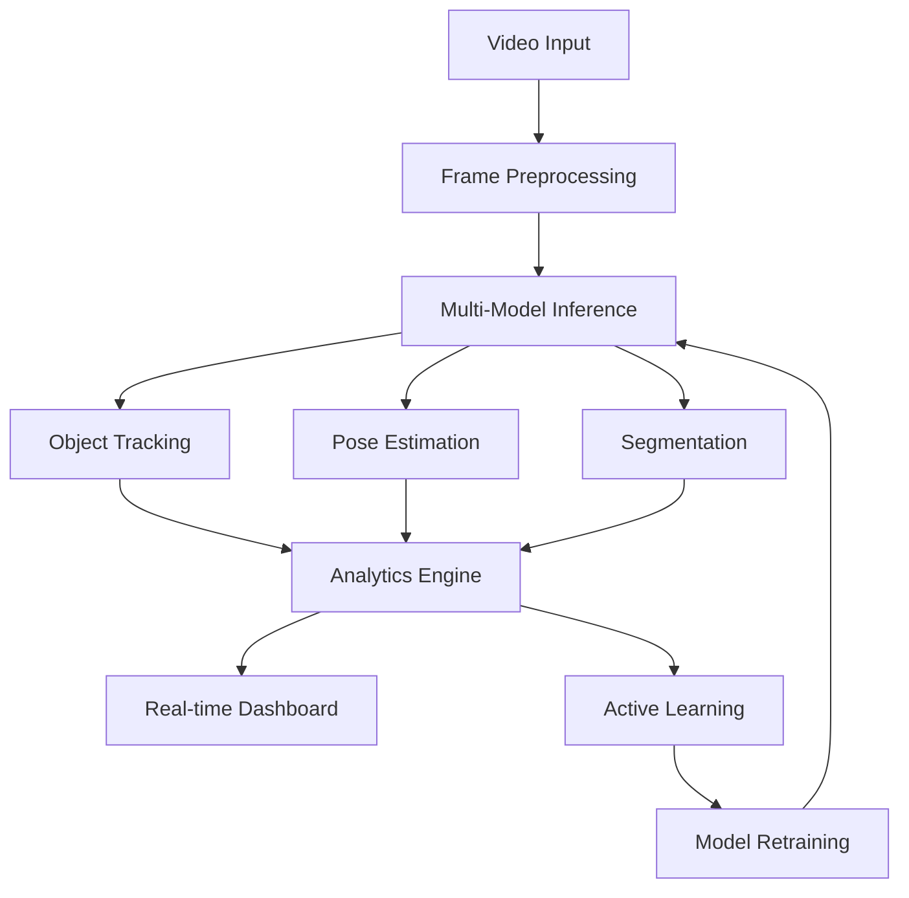

# 🚀 Advanced Object Detection System v2.0

**Enterprise-grade real-time object detection platform** with AI-powered features, built on cutting-edge technologies including FastAPI, multiple YOLO variants, RT-DETR, and advanced computer vision capabilities. This system provides comprehensive object detection, tracking, pose estimation, and intelligent learning features for production environments.

<div align="center">
  
  
  
  
  
</div>

## ✨ Key Features

### 🔍 **Multi-Model AI Detection**
- **YOLOv8/v9** - Latest YOLO architectures with superior accuracy
- **RT-DETR** - Real-time DETR for enhanced detection
- **Model Ensemble** - Combine multiple models for better results
- **Dynamic Model Switching** - Switch between models in real-time

### 🎯 **Advanced Computer Vision**
- **Object Tracking** - Multi-object tracking with trails and analytics
- **Pose Estimation** - Human pose detection and keypoint analysis
- **Semantic Segmentation** - Pixel-level object segmentation
- **Depth Estimation** - 3D depth perception (optional)

### 🤖 **AI-Powered Learning**
- **Active Learning** - Smart sample selection for annotation
- **Auto-Annotation** - AI-powered automatic labeling
- **Continuous Learning** - Model improvement over time
- **Model Ensemble** - Combine predictions from multiple models

### 📊 **Real-time Analytics**
- **Live Dashboards** - Real-time performance monitoring
- **Performance Metrics** - FPS, latency, accuracy tracking
- **Alert System** - Configurable alerts and notifications
- **Data Visualization** - Interactive charts and heatmaps

### 🔐 **Enterprise Security**
- **JWT Authentication** - Secure token-based authentication
- **Role-based Access Control** - Fine-grained permissions
- **Rate Limiting** - API protection and throttling
- **Audit Logging** - Comprehensive security logging

### 🏗️ **Production Ready**
- **Docker Containers** - Easy deployment and scaling
- **Kubernetes Support** - Orchestration and auto-scaling
- **Load Balancing** - High availability architecture
- **Monitoring Stack** - Prometheus + Grafana integration

## 🏗️ Architecture Overview

```
adaptive-object-detector/
├── src/                    # Source code
│   ├── api/               # FastAPI application
│   │   └── main.py       # API server with WebSocket support
│   ├── core/             # Core functionality
│   │   ├── config.py     # Configuration management
│   │   ├── cv_processor.py # Computer vision pipeline
│   │   └── ml_pipeline.py # AI/ML pipeline
│   ├── models/           # Model management
│   │   └── model_manager.py # Multi-model support
│   ├── database/         # Data persistence
│   │   └── manager.py    # Database operations
│   ├── monitoring/       # System monitoring
│   │   └── metrics.py    # Performance metrics
│   └── utils/            # Utilities
│       └── security.py   # Security functions
├── frontend/             # React frontend
│   ├── src/             # React source code
│   └── package.json     # Frontend dependencies
├── configs/              # Configuration files
│   └── config.yaml      # Main configuration
├── docker/               # Container setup
│   ├── Dockerfile       # Application container
│   ├── docker-compose.yml # Multi-service setup
│   └── k8s/             # Kubernetes manifests
├── tests/                # Test suites
├── docs/                 # Documentation
└── scripts/              # Utility scripts
```

## 🛠️ Technology Stack

### **Backend Technologies**
- **FastAPI** - High-performance async API framework
- **PyTorch** - Deep learning framework
- **Ultralytics** - YOLOv8/v9 implementation
- **OpenCV** - Computer vision operations
- **SQLAlchemy** - Database ORM with async support
- **Redis** - Caching and rate limiting
- **WebSocket** - Real-time communication

### **AI/ML Technologies**
- **YOLOv8/v9** - State-of-the-art object detection
- **RT-DETR** - Real-time transformer detection
- **ByteTrack** - Multi-object tracking
- **Pose Estimation** - Human pose analysis
- **Segmentation** - Instance and semantic segmentation

### **Frontend Technologies**
- **React 18** - Modern UI framework
- **Material-UI** - Component library
- **TypeScript** - Type-safe development
- **Socket.IO** - Real-time updates
- **Recharts** - Data visualization

### **Infrastructure**
- **Docker** - Containerization
- **Kubernetes** - Container orchestration
- **PostgreSQL** - Primary database
- **Prometheus** - Metrics collection
- **Grafana** - Monitoring dashboards
- **Nginx** - Reverse proxy and load balancer

## 📋 System Requirements

### **Minimum Requirements**
- **OS**: Linux, Windows 10+, macOS 10.15+
- **CPU**: 4+ cores, 2.0+ GHz
- **RAM**: 8GB+ (16GB recommended)
- **Storage**: 20GB+ free space
- **Python**: 3.11+

### **Recommended Requirements**
- **GPU**: NVIDIA GPU with 6GB+ VRAM (RTX 3060+)
- **RAM**: 32GB+ for multiple models
- **CPU**: 8+ cores for high throughput
- **Storage**: SSD for faster model loading

## ⚙️ Quick Start

### **Option 1: Development Setup**

```bash
# Clone the repository
git clone https://github.com/BHARGAV15008/Advanced-Object-Detection-System.git
cd adaptive-object-detector

# Create virtual environment
python -m venv venv
source venv/bin/activate  # On Windows: venv\Scripts\activate

# Install dependencies
pip install -r requirements.txt

# Configure the system
cp configs/config.yaml.example configs/config.yaml
# Edit configs/config.yaml as needed

# Start the FastAPI server
python -m src.api.main
```

### **Option 2: Docker Deployment**

```bash
# Clone and navigate
git clone https://github.com/BHARGAV15008/Advanced-Object-Detection-System.git
cd adaptive-object-detector

# Start with Docker Compose
docker-compose -f docker/docker-compose.yml up -d

# Access the application at http://localhost:8000
```

### **Option 3: Kubernetes Deployment**

```bash
# Apply Kubernetes manifests
kubectl apply -f docker/k8s/

# Check deployment status
kubectl get pods -n object-detection
```

## 🎮 Usage Guide

### **Web Interface**

1. **Dashboard** (`http://localhost:8000`)
   - Real-time video feed with detection overlays
   - Live performance metrics and system status
   - Object count statistics and analytics

2. **Model Management**
   - Switch between different AI models
   - Compare model performance
   - Upload and train custom models

3. **Data Annotation**
   - Interactive labeling interface
   - Batch annotation tools
   - Quality control and review

### **API Usage**

```python
import requests

# Authentication
response = requests.post('http://localhost:8000/auth/login', 
    json={'username': 'admin', 'password': 'admin123'})
token = response.json()['access_token']
headers = {'Authorization': f'Bearer {token}'}

# Upload image for detection
with open('image.jpg', 'rb') as f:
    files = {'file': f}
    response = requests.post('http://localhost:8000/inference/image', 
        files=files, headers=headers)
    detections = response.json()

# Get system status
response = requests.get('http://localhost:8000/status', headers=headers)
status = response.json()
```

### **WebSocket Real-time Feed**

```javascript
const socket = io('ws://localhost:8000/ws/live-feed');

socket.on('frame_update', (data) => {
    console.log('Detections:', data.detections);
    console.log('Analytics:', data.analytics);
    console.log('Processing time:', data.processing_time);
});
```

## 🤖 How It Works

### **AI Pipeline Architecture**



### **Core Processing Flow**

1. **Input Processing**: Video frames captured and preprocessed
2. **Multi-Model Inference**: Simultaneous processing by multiple AI models
3. **Feature Extraction**: Advanced computer vision features extracted
4. **Analytics Generation**: Real-time statistics and insights
5. **Learning Loop**: Continuous model improvement via active learning

### **AI/ML Pipeline**

- **Model Manager**: Handles multiple AI models (YOLO, RT-DETR)
- **CV Processor**: Advanced computer vision operations
- **ML Pipeline**: Active learning and continuous improvement
- **Analytics Engine**: Real-time performance monitoring

## 📡 API Reference

### **Authentication Endpoints**
```bash
POST /auth/login          # User authentication
POST /auth/logout         # User logout
GET  /auth/me            # Current user info
```

### **Model Management**
```bash
GET    /models           # List available models
POST   /models/load      # Load specific model
POST   /models/switch    # Switch active model
DELETE /models/{name}    # Unload model
GET    /models/{name}/benchmark # Benchmark model
```

### **Inference Endpoints**
```bash
POST /inference/image     # Single image detection
POST /inference/ensemble  # Multi-model ensemble
GET  /stream/video        # Video stream
WS   /ws/live-feed       # WebSocket live feed
```

### **Analytics & Monitoring**
```bash
GET /analytics/real-time  # Current analytics
GET /analytics/history   # Historical data
GET /metrics             # Prometheus metrics
GET /status              # System status
```

### **Data Management**
```bash
POST /data/label         # Label objects
GET  /data/annotations   # Get annotations
GET  /data/datasets      # List datasets
POST /data/export        # Export data
```

## ⚙️ Advanced Configuration

### **Configuration File Structure**

```yaml
# configs/config.yaml
app:
  name: "Advanced Object Detection System"
  version: "2.0.0"
  environment: "production"
  port: 8000

models:
  default_model: "yolov8n"
  available_models:
    yolov8n:
      type: "yolo"
      path: "yolov8n.pt"
      confidence_threshold: 0.25
    rtdetr-l:
      type: "rt-detr"
      path: "rtdetr-l.pt"
      confidence_threshold: 0.25

cv_features:
  object_tracking:
    enabled: true
    tracker_type: "ByteTrack"
  pose_estimation:
    enabled: true
    model: "yolov8n-pose.pt"
  semantic_segmentation:
    enabled: true
    model: "yolov8n-seg.pt"

ml_pipeline:
  active_learning:
    enabled: true
    uncertainty_threshold: 0.7
  continuous_learning:
    enabled: false
    retrain_interval: "weekly"

monitoring:
  enabled: true
  alerts:
    enabled: true
    slack_webhook: "${SLACK_WEBHOOK}"

database:
  type: "postgresql"  # or sqlite
  host: "localhost"
  port: 5432
```

### **Environment Variables**

```bash
# Security
JWT_SECRET=your-secret-key
DB_PASSWORD=your-db-password
REDIS_PASSWORD=your-redis-password

# Monitoring
SLACK_WEBHOOK=https://hooks.slack.com/...
GRAFANA_PASSWORD=your-grafana-password

# Storage (Optional)
S3_BUCKET=your-s3-bucket
S3_ACCESS_KEY=your-access-key
S3_SECRET_KEY=your-secret-key
```

### **Hardware Optimization**

```yaml
hardware:
  gpu:
    enabled: true
    device_ids: [0]  # Use specific GPU
    memory_fraction: 0.8
  cpu:
    num_workers: 4
    inference_threads: 2
  camera:
    default_source: 0
    resolution: [1920, 1080]
    fps: 30
```

## 🎯 Use Cases

- **Educational**: Learn about object detection and machine learning
- **Prototyping**: Quickly create custom object detection systems
- **Research**: Experiment with interactive learning approaches
- **Security**: Custom object detection for specific environments
- **Inventory**: Count and track specific objects in real-time

## 🐛 Troubleshooting

### Common Issues

1. **Camera not detected**:
   - Check camera permissions
   - Try different camera indices (0, 1, 2...)
   - Ensure no other applications are using the camera

2. **Model loading errors**:
   - Check internet connection for initial YOLOv5 download
   - Verify PyTorch installation
   - Ensure sufficient memory for model loading

3. **Slow performance**:
   - Use GPU acceleration if available
   - Reduce video resolution
   - Close unnecessary applications

## 🤝 Contributing

1. Fork the repository
2. Create a feature branch
3. Make your changes
4. Test thoroughly
5. Submit a pull request

## 📝 License

This project is open-source. Please check the license file for details.

## 🔮 Future Enhancements

- Multiple camera support
- Object tracking across frames
- Export trained models
- Batch image processing
- Mobile app integration
- Cloud deployment options
- Advanced metrics and analytics

## 📞 Support

For issues, questions, or contributions, please open an issue in the repository or contact the development team.

---

**Note**: This application requires a webcam and will download YOLOv5 models on first run. Ensure you have a stable internet connection for initial setup.
